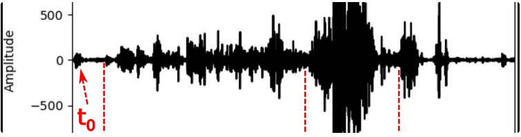

----
# Processamento do Sinal Sísmico (ProSeisSN)

This repository contains relevant material and notebooks to guide students through the practical activities of the Course **ProSeisSN**.

----
## Running the course codes on the cloud
- **Run** the notebooks from this **GitHub** Repo on the cloud by opening **Binder** on another tab \
  by clicking with the left mouse button on $\rightarrow$ 

- **Share** the **Binder** with the URL:\
     `https://mybinder.org/v2/gh/jandyr/ProSeisSN/HEAD`
  
- **Notebook handling with AI**: Use **Colab** by going to  [Google Colab](https://colab.research.google.com/), which supports URLs that link directly to a GitHub browser.
 
- **Locally**: Create the *Course Environment* on your local machine, by installing the relevant software. Follow the instructions in the *Unit Notes* to install.

----

## ProSeisSN structure

- **Unit**$\mathbf{nn}$: Material for each Unit of the Course \
 **├── MdlExpo**: Expositive material in *pdf* \
 **├── MdlNbk**:  Jupyter Notebooks used in the practical units \
 **└── MdlExs**:  Practical exercises \
 **$\qquad$ $\quad$ ├── Data**: Data used in the Notebooks \
 **$\qquad$ $\quad$ └── Codes**: Extra codes for the Notebooks 

---
## Course content

- [**Unit01**](https://github.com/jandyr/ProSeisSN/tree/main/Unit01): Overview of Geophysics. Course environment

- [**Unit02**](https://github.com/jandyr/ProSeisSN/tree/main/Unit02): Introduction to Obspy and data retrieving

- [**Unit03**](https://github.com/jandyr/ProSeisSN/tree/main/Unit03): Processing passive seismic data I

- [**Unit04**](https://github.com/jandyr/ProSeisSN/tree/main/Unit04): Processing passive seismic data II

- [**Unit05**](https://github.com/jandyr/ProSeisSN/tree/main/Unit05): Processing passive seismic data III

- [**Unit06**](https://github.com/jandyr/ProSeisSN/tree/main/Unit06): The Network and Array Methods

---
##---------------------- Repository  -------------------------------
 
## Course Environment

- **JupyterLab**: A web--based user interface to work with the {\bf Jupyter Notebooks}.

- **Binder**: To execute the {\bf Jupyter Notebooks} on the cloud.

- **Google Colab**: A handy way to edit the notebooks from the github repo. **NB** notebooks are not designed to run in **Google Colab**.

- **GitHub**: The *Git* cloud repository with a version control system.

- **Google Classroom**: Course’s discussions, assignments and Projects $\rightarrow$  

- **Anaconda**: to create a Python environment on your machine for running the Course's codes locally.

---
## Additional Resources

Fork this repository to a directory on your local machine by

     `git clone https://github.com/jandyr/ProSeisSN`
     `cd ProSeisSN`

this way your local changes are kept *local*. Alternatively you can simply *Download ZIP* to your local directory, using the *big green button*.

Create a conda local environment for running data exercises using

     `conda env create -f environment.yml`.

Activate the environment with

     `conda activate ProSeisSN`

and deactivate it with

     `conda deactivate`

## Web references

Students are directed to reference from the Literature in the **Unit Notes**. The following refers to the basics in contructing the Course environment.

* [Short Python tutorial](https://swcarpentry.github.io/python-novice-inflammation/index.html)
* [A Python tutorial](https://github.com/ehmatthes/intro_programming)
* [Getting Started with Anaconda](https://docs.anaconda.com/anaconda/user-guide/getting-started/)
* [Jupyter Notebook Overview](https://jupyter-notebook.readthedocs.io/en/stable/)
* [ObsPy Tutorial](https://docs.obspy.org/tutorial/)
* [Matplotlib]([https://docs.obspy.org/tutorial/](https://nbviewer.org/github/matplotlib/AnatomyOfMatplotlib/tree/master/))
